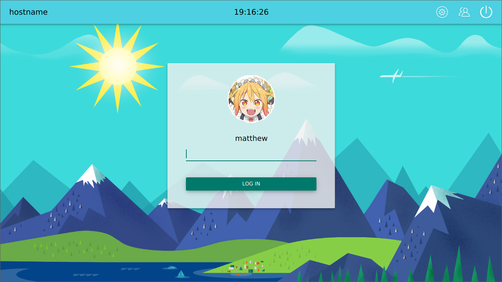

sddm_wynn theme
===============

A flexible, configurable, material SDDM theme.  Most values are configurable via
the theme.conf file.

Features:
- [x] Select user via user picker
- [x] Select user via typing in username (configuration option)
- [x] Display organization logo instead of user icon (configuration option)
- [x] Select background image (configuration option)
- [x] Customizable color scheme (configuration option)
- [x] Set default session (configuration option)
- [x] User selects current session via menu
- [x] Select user's session via request to your API (configuration option)
- [ ] Display a usage message to the user
- [ ] Pretty icons
- [ ] Better menus for choosing user and session

## Screenshot (slightly out of date)

## Configuration file values

* `default_background`: Path to background image
* `default_session`: Session name to default to.  This is the `sessionname` in
  `/usr/share/xsessions/sessionname.desktop` (i.e. `cinnamon` or `cinnamon2d`,
  NOT `Cinnamon (Software Rendering)`)
* `accent1`: The color of the top bar
* `accent2`: The color of other items, like the "LOG IN" button
* `accent2_hover`: The color that will be applied on hover to accent2 items
* `logo`: Path to the image that will be placed in the spot usually filled by a
  face icon
* `user_name`: `fill` to have the user fill in their own username, or `select`
  if you would like to provide a menu of users to choose from
* `session_api`: A url which will return the user's preferred desktop
  environment (yes, this was made with a very specific use-case in mind)

### Session API

The session API value is useful if, for example, you are running a linux lab of
many users, and users can choose a desktop environment to be associated with
their account.  This could be done via LDAP and an small API.

The greeter theme will read your `session_api` value from the configuration
file, replace `%s` with the username, perform an HTTP `GET` request, and use the
body of the result as the session name.  Again, the session name should be the
`sessionname` in `/usr/share/xsessions/sessionname.desktop` (i.e. `cinnamon` or
`cinnamon2d`, NOT `Cinnamon (Software Rendering)`).  If the API returns `N`,
then it will reset to the `default_session` configuration value.

For example, if your `session_api` is `http://ldap-api.mylab.com/%s/session/0`
and a user types in their name `m_wynn` into the username box, as soon as they
focus away from the username box, the theme will `GET`
`http://ldap-api.mylab.com/m_wynn/session/0`.  If the result is `N`, the
`default_session` will be used.  Otherwise, the body of the response is used as
the session name.
